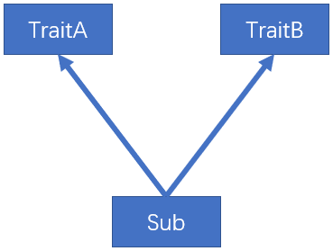
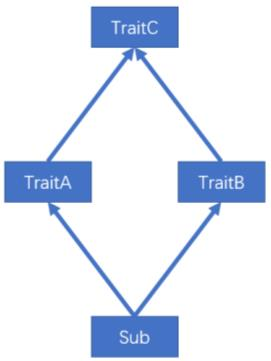
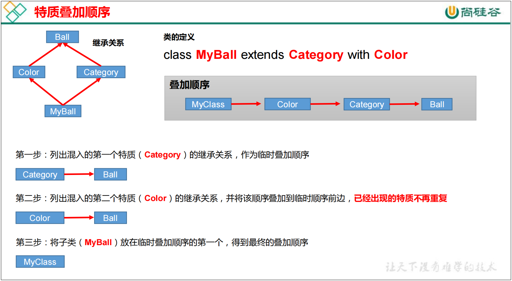

# 6 面向对象
## 6.1 scala 包
```markdown
1）基本语法
package 包名
2）Scala 包的三大作用（和 Java 一样）
（1）区分相同名字的类
（2）当类很多时，可以很好的管理类
（3）控制访问范围
```
### 6.1.2 包说明（包语句）
> 06-01
```markdown
Scala 有两种包的管理风格: 
一种方式和 Java 的包管理风格相同，每个源文件一个包（包名和源文件所在路径不要求必须一致）。
包名用“.”进行分隔以表示包的层级关系，如
com.atguigu.scala。

第二种风格有以下特点：
（1）一个源文件中可以声明多个 package
（2）子包中的类可以直接访问父包中的内容，而无需导包
（3）父包访问子包需要导包，无法直接访问
```
```scala
// 第二种风格，通过嵌套的风格表示层级关系，如下
package com{
    package atguigu{
        package scala{
        }
    }
}
```
### 6.1.3 包对象
> 06-02 && package
> 
> 在 Scala 中可以为每个包定义一个同名的包对象，
> 定义在包对象中的成员，作为其对应包下所有 class 和 object 的共享变量，可以被直接访问。 
```markdown  
（1）若使用 Java 的包管理风格，则包对象一般定义在其对应包下的 package.scala文件中，包对象名与包名保持一致。
（2）如采用嵌套方式管理包，则包对象可与包定义在同一文件中，但是要保证包对象与包声明在同一作用域中。
```
### 6.1.4 导包说明
> 06-01
```markdown
1）和 Java 一样，可以在顶部使用 import 导入，在这个文件中的所有类都可以使用。
2）局部导入：什么时候使用，什么时候导入。在其作用范围内都可以使用
3）通配符导入：import java.util._
4）给类起名：import java.util.{ArrayList=>JL}
5）导入相同包的多个类：import java.util.{HashSet, ArrayList}
6）屏蔽类：import java.util.{ArrayList =>_,_}
7）导入包的绝对路径：new _root_.java.util.HashMap
```
```scala
// 7）导入包的绝对路径：new _root_.java.util.HashMap
package java {
  package util {
    class HashMap {
    }
  }
}
```
| 导包                                  | 说明          |
| :---:                                |    :----:   |
|import com.atguigu.Fruit              |    引入 com.atguigu 包下 Fruit（class 和 object）    |
|import com.atguigu._                  |    引入 com.atguigu 下的所有成员    |
|import com.atguigu.Fruit._            |    引入 Fruit(object)的所有成员   |
|import com.atguigu.{Fruit,Vegetable}  |    引入 com.atguigu 下的 Fruit 和 Vegetable |
|import com.atguigu.{Fruit=>Shuiguo}   |    引入 com.atguigu 包下的 Fruit 并更名为 Shuiguo   |
|import com.atguigu.{Fruit=>Shuiguo,_} |    引入 com.atguigu 包下的所有成员，并将 Fruit 更名为 Shuiguo |
|import com.atguigu.{Fruit=>_,_}       |    引入 com.atguigu 包下屏蔽 Fruit 类 |
|new _root_.java.util.HashMap          |    引入的 Java 的绝对路径  |
```markdown
# 注意
Scala 中的三个默认导入分别是
import java.lang._
import scala._
import scala.Predef._
```

## 6.2 类和对象
> 06-03 
> 
> 类：可以看成一个模板 \
> 对象：表示具体的事物
### 6.2.1 定义类
> 06-03
```markdown
1）回顾：Java 中的类
如果类是 public 的，则必须和文件名一致。
一般，一个.java 有一个 public 类
注意：Scala 中没有 public，一个.scala 中可以写多个类。
1）基本语法
[修饰符] class 类名 {
类体
}
# 说明
（1）Scala 语法中，类并不声明为 public，所有这些类都具有公有可见性（即默认就是 public ）
（2）一个 Scala 源文件可以包含多个类
```
### 6.2.2 属性
```markdown
属性是类的一个组成部分
1）基本语法
[修饰符] var|val 属性名称 [：类型] = 属性值
注：Bean 属性（@BeanPropetry），可以自动生成规范的 setXxx/getXxx 方法
```
## 6.3 封装
> 06-03
```markdown
封装就是把抽象出的数据和对数据的操作封装在一起，数据被保护在内部，程序的其它
部分只有通过被授权的操作（成员方法），才能对数据进行操作。Java 封装操作如下，
（1）将属性进行私有化
（2）提供一个公共的 set 方法，用于对属性赋值
（3）提供一个公共的 get 方法，用于获取属性的值
Scala 中的 public 属性，底层实际为 private，并通过 get 方法（obj.field()）和 set 方法（obj.field_=(value)）对其进行操作。
所以 Scala 并不推荐将属性设为 private，再为其设置 public 的 get 和 set 方法的做法。但由于很多 Java 框架都利用反射调用 getXXX 和 setXXX 方法，
有时候为了和这些框架兼容，也会为 Scala 的属性设置 getXXX 和 setXXX 方法（通过@BeanProperty 注解实现）
```

### 6.1.5 访问权限
> 06-04
```markdown
1）说明
在 Java 中，访问权限分为：public，private，protected 和默认。在 Scala 中，你可以通过类似的修饰符达到同样的效果。但是使用上有区别。
（1）Scala 中属性和方法的默认访问权限为 public，但 Scala 中无 public 关键字。
（2）private 为私有权限，只在类的内部和伴生对象中可用。
（3）protected 为受保护权限，Scala 中受保护权限比 Java 中更严格，同类、子类可以访问，同包无法访问。
（4）private[包名]增加包访问权限，包名下的其他类也可以使用
```
### 6.2.3 方法
```markdown
1）基本语法
def 方法名(参数列表) [：返回值类型] = {
方法体
}
```
### 6.2.4 创建对象
> 06-04
```markdown
1）基本语法
val | var 对象名 [：类型] = new 类型()
2）案例实操
（1）val 修饰对象，不能改变对象的引用（即：内存地址），可以改变对象属性的值。
（2）var 修饰对象，可以修改对象的引用和修改对象的属性值
（3）自动推导变量类型不能多态，所以多态需要显示声明
```
### 6.2.5 构造器
> 06-05
> 
> 构造器：具体是什么含义呢？构造器，从字面上理解，就是构造，创建的意思，英文里面叫做constructor，也是创建之类的意思。它就是用来新建对象的。
```markdown
和 Java 一样，Scala 构造对象也需要调用构造方法，并且可以有任意多个构造方法。
Scala 类的构造器包括：主构造器和辅助构造器
1）基本语法
class 类名(形参列表) { // 主构造器
    // 类体
    def this(形参列表) { // 辅助构造器
    }
    def this(形参列表) { //辅助构造器可以有多个...
    }
}
说明：
（1）辅助构造器，函数的名称 this，可以有多个，编译器通过参数的个数及类型来区分。
（2）辅助构造方法不能直接构建对象，必须直接或者间接调用主构造方法。
# （3）构造器调用其他另外的构造器，要求被调用构造器必须提前声明。    // 标红
```
### 6.2.6 构造器参数
> 06-06
```markdown
1）说明
Scala 类的主构造器函数的形参包括三种类型：未用任何修饰、var 修饰、val 修饰
（1）未用任何修饰符修饰，这个参数就是一个局部变量
（2）var 修饰参数，作为类的成员属性使用，可以修改
（3）val 修饰参数，作为类只读属性使用，不能修改
```
## 6.4 继承和多态
> 06-07 \
> 多态：动态绑定  ---》》》》 06-08
```markdown
1）基本语法
class 子类名 extends 父类名 { 类体 }
（1）子类继承父类的属性和方法
（2）scala 是单继承   //  一个父类
2）案例实操
（1）子类继承父类的属性和方法
（2）继承的调用顺序：父类构造器->子类构造器 
#3）
# Scala 中属性和方法都是动态绑定，而 Java 中只有方法为动态绑定。
```


## 6.5 抽象类
### 6.5.1 抽象属性和抽象方法
> 06-09
```markdown
1）基本语法
（1）定义抽象类：abstract class Person{} //通过 abstract 关键字标记抽象类
（2）定义抽象属性：val|var name:String //一个属性没有初始化，就是抽象属性
（3）定义抽象方法：def hello():String //只声明而没有实现的方法，就是抽象方法
2）继承&重写
（1）如果父类为抽象类，那么子类需要将抽象的属性和方法实现，否则子类也需声明
为抽象类
（2）重写非抽象方法需要用 override 修饰，重写抽象方法则可以不加 override。
（3）子类中调用父类的方法使用 super 关键字
（4）子类对抽象属性进行实现，父类抽象属性可以用 var 修饰；
    子类对非抽象属性重写，父类非抽象属性只支持 val 类型，而不支持 var。
#   因为 var 修饰的为可变变量，子类继承之后就可以直接使用，没有必要重写
```
### 6.5.2 匿名子类
> 06-10
```markdown
1）说明
和 Java 一样，可以通过包含带有定义或重写的代码块的方式创建一个匿名的子类。
2）案例实操
```
## 6.6 单例对象（伴生对象）
> 06-11
```markdown
Scala语言是完全面向对象的语言，所以并没有静态的操作（即在Scala中没有静态的概
念）。但是为了能够和Java语言交互（因为Java中有静态概念），就产生了一种特殊的对象
来模拟类对象，该对象为单例对象。若单例对象名与类名一致，则称该单例对象这个类的伴
生对象，这个类的所有“静态”内容都可以放置在它的伴生对象中声明。
```
### 6.6.1 单例对象语法 
> 06-11
```markdown
1）基本语法
object Person{
val country:String="China"
}
2）说明
（1）单例对象采用 object 关键字声明
（2）单例对象对应的类称之为伴生类，伴生对象的名称应该和伴生类名一致。
（3）单例对象中的属性和方法都可以通过伴生对象名（类名）直接调用访问
```
### 6.6.2 apply 方法
> 06-11 \
> //注意：也可以创建其它类型对象，并不一定是伴生类对象
```markdown
1）说明
（1）通过伴生对象的 apply 方法，实现不使用 new 方法创建对象。
（2）如果想让主构造器变成私有的，可以在()之前加上 private。
（3）apply 方法可以重载。
（4）Scala 中 obj(arg)的语句实际是在调用该对象的 apply 方法，即 obj.apply(arg)。用
以统一面向对象编程和函数式编程的风格。
（5）当使用 new 关键字构建对象时，调用的其实是类的构造方法，当直接使用类名构
建对象时，调用的其实时伴生对象的 apply 方法。
```
### 扩展：在 Scala 中实现单例模式
> 06-12


## 6.7 特质（Trait）
```markdown
Scala 语言中，采用特质 trait（特征）来代替接口的概念，也就是说，多个类具有相同
的特质（特征）时，就可以将这个特质（特征）独立出来，采用关键字 trait 声明。
Scala 中的 trait 中即可以有抽象属性和方法，也可以有具体的属性和方法，一个类可
以混入（mixin）多个特质。这种感觉类似于 Java 中的抽象类。
Scala 引入 trait 特征，第一可以替代 Java 的接口，第二个也是对单继承机制的一种
补充。
```
### 6.7.1 特质声明
> 06-13
```markdown
1）基本语法
trait 特质名 {
    trait 主体
}
通过查看字节码，可以看到特质=抽象类+接口
```

### 6.7.2 特质基本语法
> 06-13 \
> 06-14 动态混入
> 
```markdown
一个类具有某种特质（特征），就意味着这个类满足了这个特质（特征）的所有要素，
所以在使用时，也采用了 extends 关键字，如果有多个特质或存在父类，那么需要采用 with
关键字连接。
1）基本语法：
没有父类：class 类名 extends 特质 1 with 特质 2 with 特质 3 …
有父类：class 类名 extends 父类 with 特质 1 with 特质 2 with 特质 3…
2）说明
（1）类和特质的关系：使用继承的关系。
（2）当一个类去继承特质时，第一个连接词是 extends，后面是 with。
（3）如果一个类在同时继承特质和父类时，应当把父类写在 extends 后。
3）案例实操
（1）特质可以同时拥有抽象方法和具体方法
（2）一个类可以混入（mixin）多个特质
（3）所有的 Java 接口都可以当做 Scala 特质使用
（4）动态混入：可灵活的扩展类的功能
（4.1）动态混入：创建对象时混入 trait，而无需使类混入该 trait
（4.2）如果混入的 trait 中有未实现的方法，则需要实现
```
### 6.7.3 特质叠加
> 6-14 特质叠加
```markdown
由于一个类可以混入（mixin）多个 trait，且 trait 中可以有具体的属性和方法，若混入
的特质中具有相同的方法（方法名，参数列表，返回值均相同），必然会出现继承冲突问题。
冲突分为以下两种

第一种，一个类（Sub）混入的两个 trait（TraitA，TraitB）中具有相同的具体方法，且
两个 trait 之间没有任何关系，解决这类冲突问题，直接在类（Sub）中重写冲突方法。
```

```markdown

第二种，一个类（Sub）混入的两个 trait（TraitA，TraitB）中具有相同的具体方法，且
两个 trait 继承自相同的 trait（TraitC），及所谓的“钻石问题”，解决这类冲突问题，Scala
采用了特质叠加的策略。
```

> 所谓的特质叠加，就是将混入的多个 trait 中的冲突方法叠加起来，案例如下\
> 6-14 特质叠加

### 6.7.4 特质叠加执行顺序
> 6-15 特质叠加顺序
```markdown
当一个类混入多个特质的时候，scala 会对所有的特质及其父特质按照一定的顺序进行
排序，而此案例中的 super.describe()调用的实际上是排好序后的下一个特质中的 describe()
方法。，排序规则如下：
```

> 结论：\
（1）案例中的 super，不是表示其父特质对象，而是表示上述叠加顺序中的下一个特质，
即，MyClass 中的 super 指代 Color，Color 中的 super 指代 Category，Category 中的 super
指代 Ball。
（2）如果想要调用某个指定的混入特质中的方法，可以增加约束：super[]，例如super[Category].describe()。

### 6.7.5 特质自身类型
> 6-16
```markdown
1）说明
自身类型可实现依赖注入的功能。
```
### 6.7.6 特质和抽象类的区别
> 1.优先使用特质。一个类扩展多个特质是很方便的，但却只能扩展一个抽象类。 \
2.如果你需要构造函数参数，使用抽象类。因为抽象类可以定义带参数的构造函数，
而特质不行（有无参构造）

## 6.8 扩展
### 6.8.1 类型检查和转换
> 6-17 \
1）说明 \
（1）obj.isInstanceOf[T]：判断 obj 是不是 T 类型。 \
（2）obj.asInstanceOf[T]：将 obj 强转成 T 类型。
（3）classOf 获取对象的类名

### 6.8.2 枚举类和应用类
> 6-17 \
1）说明 \
枚举类：需要继承 Enumeration \
应用类：需要继承 App

### 6.8.3 Type 定义新类型
> 6-17 \
1）说明 \
> 使用 type 关键字可以定义新的数据数据类型名称，本质上就是类型的一个别名